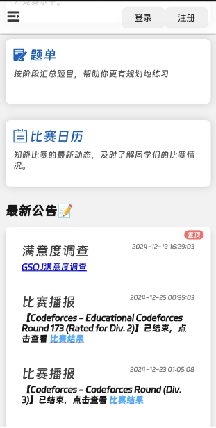
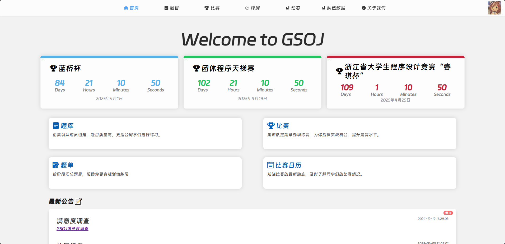
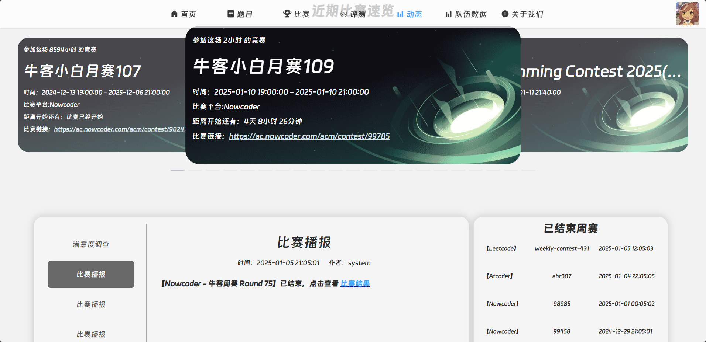
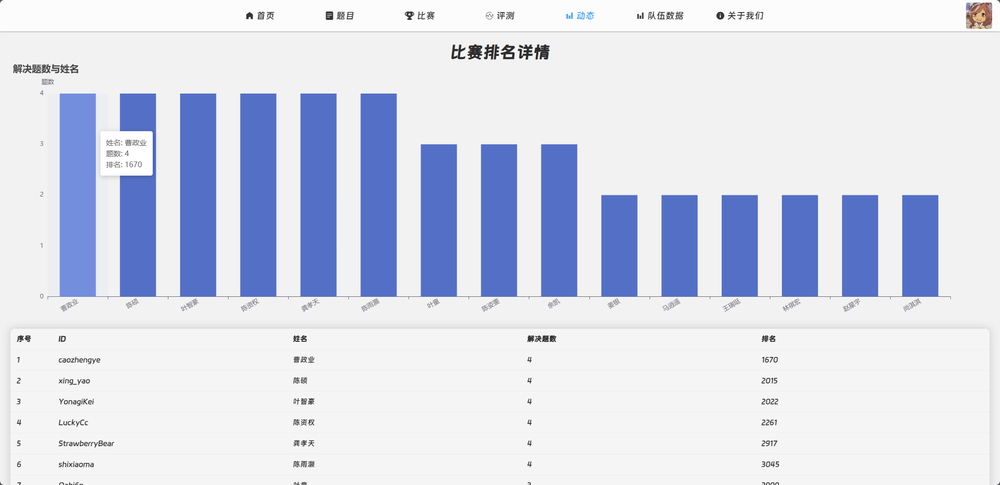
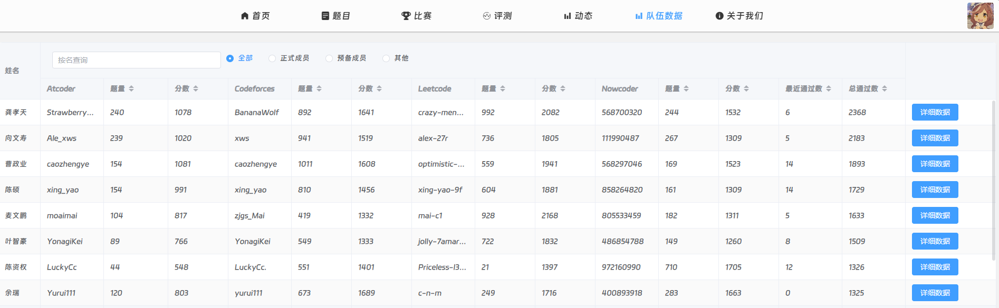
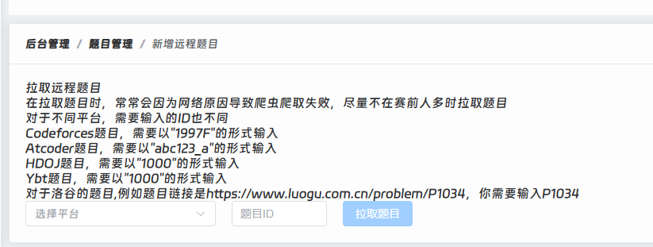
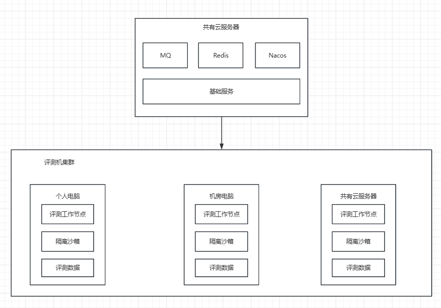

# 特点

## 响应式布局

简洁友好的页面，支持手机端、PC端的自适应布局

手机端

PC网页端

## 爬虫集成

有区别于其他OJ，GSOJ所集成的爬虫服务，是针对当下竞赛团队管理痛点所定制开发的，旨在提升团队管理效率。

### 汇总比赛情况

汇总近期可参加的比赛，比赛结束后自动爬取团队成员周赛情况。

点击比赛结果查看比赛详情，排名结果的收录与否取决于用户提供的ID是否正确

### 更新成员信息

定期更新团队成员的训练情况，包括通过题数、Rating分数等关键信息

### 添加远程题目

支持拉取多个平台的题面信息，但需要自行上传评测数据

## 评测机扩展

GSOJ具备极强的水平扩展能力，所需成本极低，可以在个人电脑、学校机房、云服务器等可连接网络的设备上部署评测机。

基础服务与评测机之间通过消息队列分发评测任务和响应返回结果，理论上该设备只要能连接网络，安装Docker，无需公网IP，即可加入评测机集群。

关于评测数据同步问题，GSOJ采用rsync进行增量数据同步，公有云服务器主节点，评测机作为工作节点，定时拉取评测数据

## 安全

所有服务均使用Docker部署，Docker 容器提供了进程、网络和文件系统的隔离。每个应用都在自己的容器中运行，这有助于限制潜在的安全问题只影响到该容器，而不会波及宿主机或其他容器。

