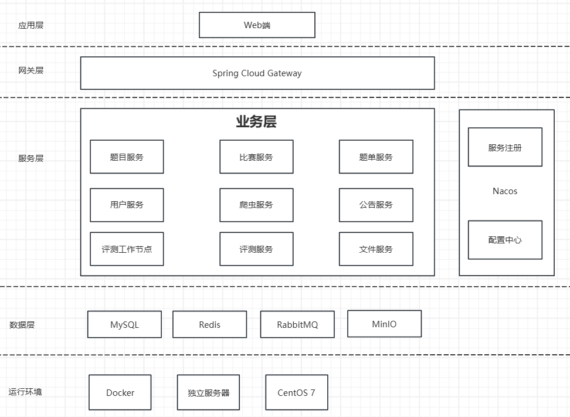
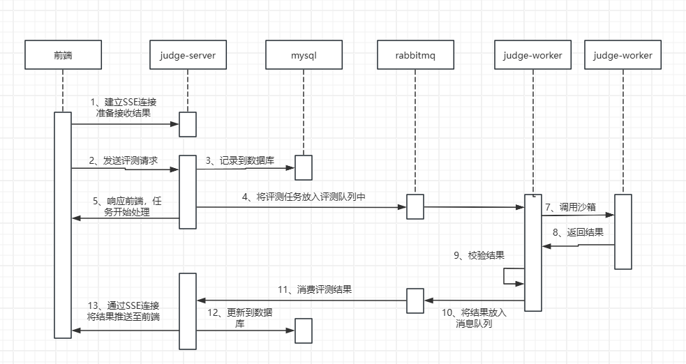

# 系统总体设计

## **技术栈**

GSOJ 采用现代化的微服务架构，结合了多种前沿技术和工具，确保系统的高效性、可扩展性和安全性。主要技术栈如下：

### 后端

- **Spring Boot + Spring Cloud Alibaba**：作为微服务框架的基础，提供了快速构建微服务应用的能力。
  
- **Nacos**：用作配置中心和注册中心，负责管理和分发应用程序配置，以及服务发现和服务管理。
  
- **RabbitMQ**：作为消息队列中间件，用于处理异步任务和分布式系统中的消息传递，确保高并发情况下的数据一致性。
  
- **OpenFeign**：用于远程调用其他微服务，简化了服务间的通信逻辑，支持声明式HTTP客户端。
  
- **Redis**：作为缓存层，加速数据访问速度，减少数据库压力，提高系统响应效率。
  
- **SaToken**：鉴权框架，提供了一套简单易用的安全认证机制，保护系统免受未授权访问。

### 前端

- **Vue 3 + Vue Router + Pinia**：使用 Vue 3 构建用户界面，Vue Router 实现单页面应用（SPA）的路由管理，Pinia 作为状态管理库，简化复杂状态的管理。
  
- **Ace Editor**：集成到前端代码编辑器中，为用户提供良好的代码编写体验，支持多种编程语言和丰富的编辑功能。

### 判题沙箱

- **Go-Judge**：作为代码沙箱，执行用户提交的代码并在安全环境中进行评测。

### 爬虫模块

- **Java Jsoup**：爬虫模块改用 Java 的 `Jsoup` 库，简化了开发流程并提高了性能和稳定性。

## 评测流程设计

评测功能更是整个项目最麻烦的一个地方

1. **用户请求流程**
   - 用户通过浏览器访问 GSOJ 平台，所有请求首先由前端处理。
   - 前端发起的 API 请求先经过 **Nginx 反向代理** 到 **API 网关**。
   - API 网关根据路由规则将请求分发到相应的后端微服务（如 judge-server、problem-server 等）。

2. **评测流程**
   - **建立 SSE 连接**：用户在前端发起评测请求之前，先与后端的 **judge-server** 建立 SSE 长连接，以便接收评测进度和结果。
   - **发起评测请求**：前端通过 API 网关向 **judge-server** 发起评测请求，包含待评测的代码和相关元数据。
   - **记录评测信息**：**judge-server** 接收到请求后，将本次评测信息记录到数据库，并设置状态为 "Pending"。
   - **放入消息队列**：**judge-server** 将评测任务放入 RabbitMQ 消息队列，作为生产者启动异步处理流程。
   - **返回立即响应**：**judge-server** 向前端返回一个即时响应，告知评测已开始，无需等待结果。
   - **消费者处理任务**：**judge-worker** 作为消费者从消息队列中取出评测任务，使用 RestTemplate 发送 HTTP 请求到 **Go-Judge** 沙箱执行评测。
   - **读取输出文件**：**judge-worker** 从本地读取评测数据的输出文件，对比沙箱返回的结果。
   - **更新评测结果**：**judge-worker** 将评测结果再次放入 RabbitMQ 消息队列，供多个消费者处理。
     - **judge-server 消费者**：负责将评测结果更新到数据库，并推送 SSE 结果到前端。
     - **problem-server 消费者**：负责更新该题目的总通过人数、总提交数等统计数据。

## Docker 化部署

GSOJ 项目使用 **Docker Compose** 进行容器化部署，所有服务（包括 Nginx、API 网关、各个微服务、RabbitMQ、Redis 等）都被打包成 Docker 容器，通过 Docker Compose 文件定义服务依赖关系和服务启动顺序，确保了环境的一致性和部署的便捷性。

